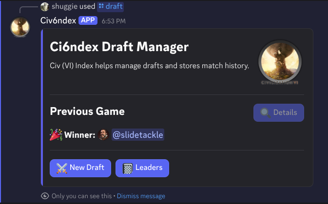
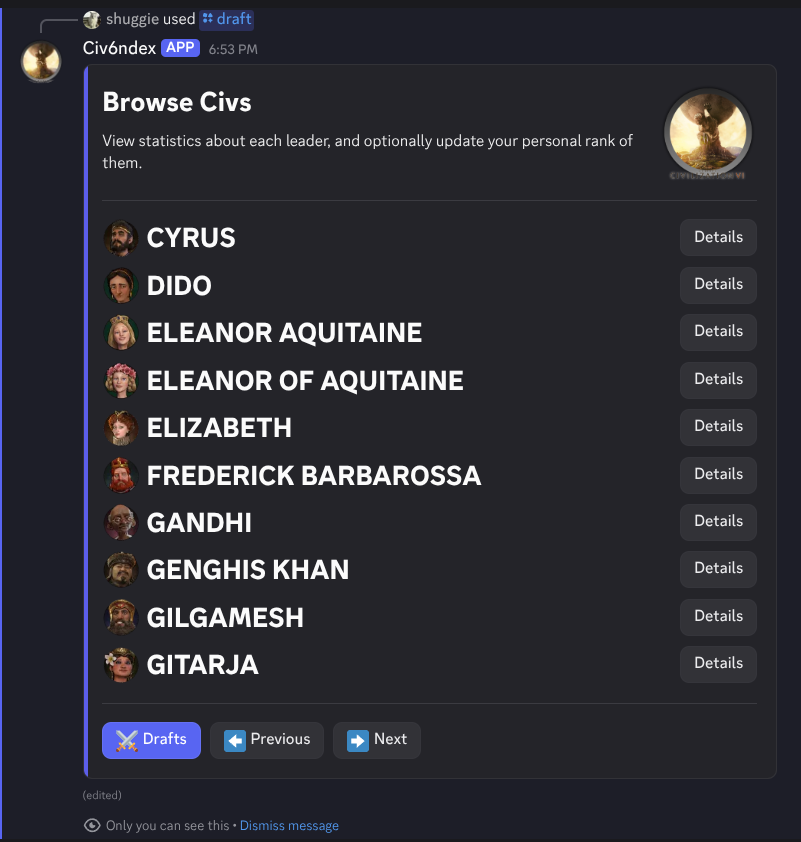
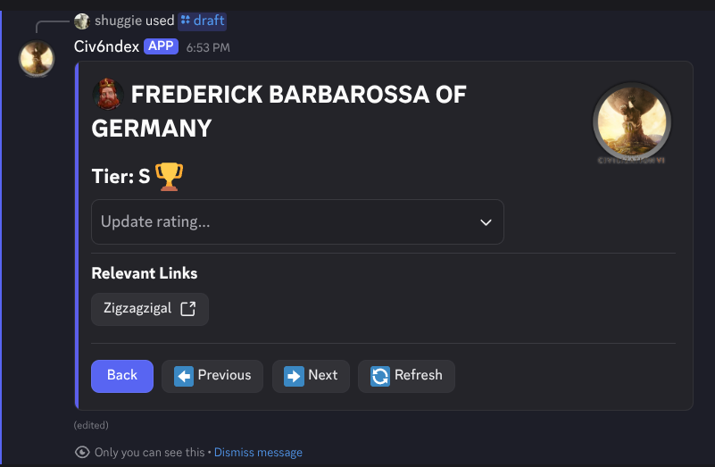

# CI6NDEX

A Discord bot for managing Civilization VI games with features for drafting leaders, rolling civs, and team management.





## Features

- Discord bot with slash commands for:
  - Leader drafting and information
  - Civ rolling
  - Team management (in development)
- SQLite database for persistent storage
- Docker deployment support

## Setup

### Requirements

- Go 1.25+
- SQLite
- Discord bot token and application ID

### Environment Variables

Create a `.env` file with:

```
DISCORD_API_TOKEN=your_token
DISCORD_BOT_APPLICATION_ID=your_app_id
GUILD_IDS=comma_separated_guild_ids
```

## Development

```bash
# List available commands
make

# Build the project
make build

# Run locally
make run

# Sync Discord commands
make sync

# Generate database models
make generate

# Build Docker image
make docker
```

## Deployment

```bash
# Deploy to production
make prod/deploy

# View logs
make prod/logs
```
