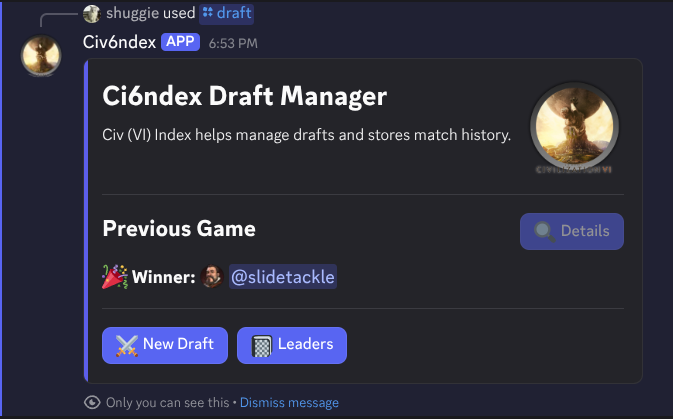
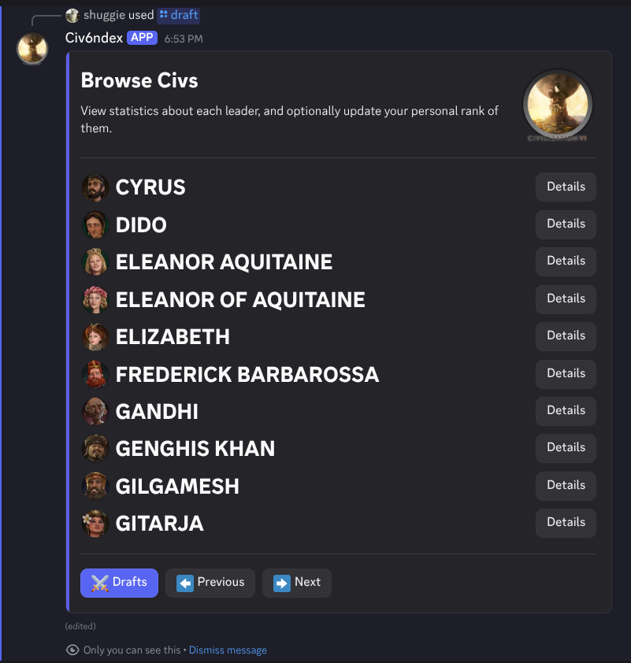
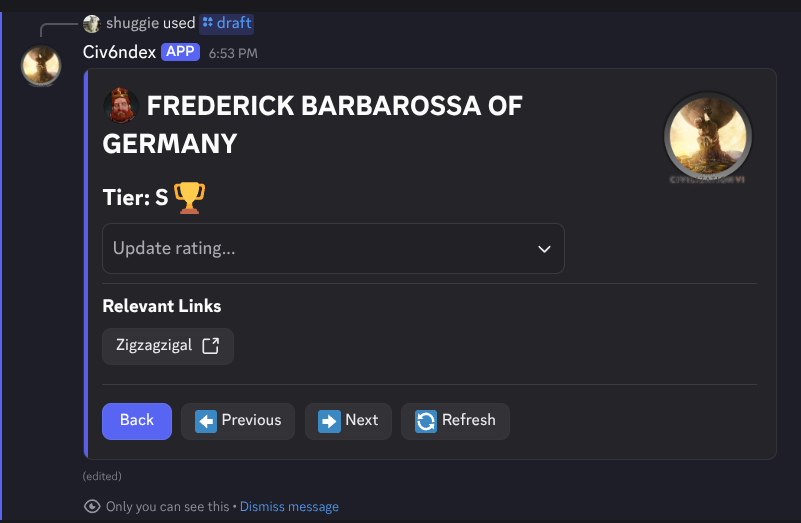

# CI6NDEX

A Discord bot for managing Civilization VI games with features for drafting leaders, rolling civs, and team management.





## Features

- Discord bot with slash commands for:
  - Leader drafting and information
  - Civ rolling
  - Team management (in development)
- SQLite database for persistent storage
- Docker deployment support

## Rolling Logic

The `/roll` command assigns each player a pool of leaders using a rule-based filtering system.

### Rules

Each rule defines a subset of eligible leaders for a player. Rules have one of two types:

- **`All`** — Every leader in the player's pool must satisfy this rule. Multiple `All` rules are intersected, so the leader must satisfy all of them simultaneously.
- **`AtLeastOne`** — At least one leader in the player's pool must satisfy this rule.

Currently configured rules:

| Rule | Type | Behavior |
|------|------|----------|
| `MinTierRule` | `AtLeastOne` | At least one leader must have a tier ≤ 3 |
| `NoOpRule` (×4) | `AtLeastOne` | No filter; acts as filler slots |

### Assignment Algorithm

For each player, in order:

1. **Evaluate `All` rules** — Start with leaders that satisfy every `All` rule (intersection). If there are no `All` rules, start with the full eligible leader list.
2. **Deduplicate globally** — Remove any leaders already assigned to a previous player.
3. **Satisfy `AtLeastOne` rules** — For each `AtLeastOne` rule, randomly pick one leader from the intersection of the remaining valid leaders and that rule's filter. Remove that leader from the pool so it is not reused for this player.
4. **Fill remaining slots** — Randomly select additional leaders from what remains until the pool is full. The pool size equals the number of rules (currently 5).
5. **Global assignment** — Mark all selected leaders as assigned so no other player receives them.

If at any point there are not enough valid leaders to fill a player's pool, the roll fails with a `RanOutOfChoicesError`.

## Setup

### Requirements

- Go 1.25+
- SQLite
- Discord bot token and application ID

### Environment Variables

Create a `.env` file with:

```
DISCORD_API_TOKEN=your_token
DISCORD_BOT_APPLICATION_ID=your_app_id
GUILD_IDS=comma_separated_guild_ids
```

## Development

```bash
# List available tasks
mise run help

# Build the project
mise run build

# Run locally
mise run run

# Sync Discord commands
mise run sync

# Generate database models
mise run generate

# Build Docker image
mise run docker
```

## Deployment

```bash
# Deploy to production
mise run prod/deploy

# View logs
mise run prod/logs
```
